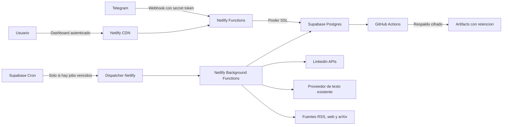

# Migracion cloud sin costo

Estado: IMPLEMENTACION LISTA, ACTIVACION BLOQUEADA POR GATES EXTERNOS

Fecha de referencia: 2026-07-25

Este directorio es la fuente de verdad para migrar `x-to-linkedin` desde la
computadora local a una arquitectura serverless basada en Netlify Free y
Supabase Free. El codigo cloud ya esta implementado; `PROGRESS.md` distingue lo
validado de las compuertas que requieren proveedor o autorizacion de corte.

## Objetivo

Mover la operacion completa a la nube sin costo incremental de infraestructura,
conservar los datos historicos y mantener el flujo editorial actual:

1. El radar busca y decide la mejor fuente disponible.
2. El borrador llega a Telegram para aprobacion.
3. La aprobacion permanece abierta indefinidamente.
4. Se pueden pedir cambios naturales desde Telegram, incluso con varias
   aprobaciones abiertas.
5. Al aprobar, el post se programa para 30 minutos despues del momento exacto
   de aprobacion.
6. Solo se adjunta multimedia real de la fuente. Nunca se generan imagenes.

## Que significa costo cero

La restriccion es costo incremental de infraestructura igual a USD 0:

- Netlify Free, con limite mensual rigido y sin auto recharge.
- Supabase Free, sin activar Pro, add-ons ni recursos pagados.
- GitHub Actions dentro de la cuota gratuita para respaldos cifrados.
- Sin dominio comprado; se usa el subdominio gratuito de Netlify.
- Sin Netlify AI Gateway ni nuevos servicios de IA de pago.

El consumo de Anthropic u OpenAI para redactar ya existe en el producto y no es
hosting. La migracion no debe crear un proveedor nuevo ni aumentar ese consumo
sin una decision explicita.

Costo cero no equivale a SLA. Netlify puede pausar el sitio al agotar creditos y
Supabase Free puede pausar un proyecto tras una semana sin actividad. El sistema
debe medir uso, trabajar con lotes pequenos y fallar sin publicar duplicados.

## Linea base local

Ultimo ensayo tomado el 2026-07-25, sin exponer credenciales:

| Elemento | Cantidad |
| --- | ---: |
| Tamano de SQLite principal | 2,236,416 bytes |
| Publicaciones | 558 |
| Publicadas | 280 |
| Con metricas historicas | 156 |
| Aprobaciones abiertas | 10 |
| Slots radar | 11 |
| Slots pausados | 43 |
| Comentarios de LinkedIn | 172 |
| Likes historicos de X | 132 |
| Tokens de LinkedIn | 1 registro |

La base cabe holgadamente en los 500 MB de Supabase Free. Los registros
`paused` deben conservarse como pausados y nunca crear jobs durante la
importacion. Las aprobaciones abiertas deben seguir respondiendo desde sus
botones existentes despues del corte; sus conteos se reconciliaran de nuevo con
el snapshot final.

## Arquitectura objetivo

No habra un servidor FastAPI residente, polling de Telegram ni APScheduler. El
estado duradero vivira en Postgres y toda ejecucion diferida pasara por una cola
idempotente.

## Decisiones cerradas

| ID | Decision | Motivo |
| --- | --- | --- |
| ADR-001 | Netlify Free para web, webhooks y funciones | Evita un proceso residente y tiene limite de gasto rigido |
| ADR-002 | Supabase Free Postgres como fuente de verdad | Reemplaza SQLite y permite concurrencia, locks y Cron |
| ADR-003 | Telegram cambia de polling a webhook | Netlify no mantiene procesos abiertos |
| ADR-004 | APScheduler se reemplaza por `job_queue` y Supabase Cron | Los jobs sobreviven despliegues y reinicios |
| ADR-005 | Esquema de aplicacion privado | Los datos y tokens no se exponen por Data API |
| ADR-006 | Dashboard protegido con Supabase Auth y usuario permitido | La interfaz local pasara a estar en internet |
| ADR-007 | Tokens de LinkedIn cifrados a nivel aplicacion | Un dump de base no debe revelar tokens utilizables |
| ADR-008 | Publicacion con idempotencia y claim atomico | Un retry nunca debe duplicar un post en LinkedIn |
| ADR-009 | Playwright queda fuera del flujo cloud principal | No encaja de forma confiable en Netlify Free |
| ADR-010 | Respaldos nocturnos cifrados en GitHub Actions | Supabase Free no incluye backups automaticos |
| ADR-011 | Se conserva el frontend actual antes de redisenarlo | Reduce el riesgo funcional de la migracion |
| ADR-012 | Un solo despliegue productivo al finalizar | Cada despliegue productivo consume creditos Netlify |

## Alcance funcional

Incluido:

- Dashboard, OAuth de LinkedIn, historial, ajustes, CSV y analitica.
- Radar diario, memoria editorial y seleccion de fuentes.
- Telegram con comandos, callbacks, cambios naturales y aprobaciones perpetuas.
- Publicacion 30 minutos despues de aprobar.
- Verificacion previa, metricas y comentarios compatibles con HTTP.
- Importacion de todo el historial y de estados activos.
- Respaldo, restauracion, observabilidad, corte y reversa.

Fuera del camino critico:

- Monitoreo automatico de likes de X, actualmente desactivado.
- Scraping que dependa exclusivamente de Chromium o Playwright.
- Generacion de imagenes y codigo heredado asociado.
- Endpoints locales para `git pull`, `restart` o reinicio del proceso.
- Dominio personalizado, SLA o recursos pagados.

Los enlaces de X enviados manualmente seguiran usando extractores HTTP. Si X no
expone el contenido, el bot debe informar la limitacion y aceptar otra fuente;
no se agregara un navegador remoto pagado.

## Artefactos de ejecucion

- [PLAN.md](./PLAN.md): fases, gates, pruebas, corte y riesgos.
- [BACKLOG.md](./BACKLOG.md): epicas, HUs y criterios de aceptacion.
- [RUNBOOK.md](./RUNBOOK.md): comandos, secretos, respaldo, corte y reversa.
- [PROGRESS.md](./PROGRESS.md): estado durable y punto exacto de reanudacion.
- [ENVIRONMENT.md](./ENVIRONMENT.md): inventario y clasificacion de variables.
- [COST_GUARDRAILS.md](./COST_GUARDRAILS.md): presupuesto USD 0 y degradacion.
- [SECURITY_AUDIT.md](./SECURITY_AUDIT.md): evidencia y hallazgo historico.
- [EVIDENCE.md](./EVIDENCE.md): resultados de pruebas, deploy y snapshot.

## Fuentes oficiales verificadas

- Netlify Free: USD 0, 300 creditos al mes y limite rigido sin cobros extra:
  https://www.netlify.com/pricing/
- Netlify Background Functions: ejecucion de hasta 15 minutos en planes Free:
  https://docs.netlify.com/build/functions/background-functions/
- Netlify Scheduled Functions: limite de 30 segundos:
  https://docs.netlify.com/build/functions/scheduled-functions/
- Supabase Free: 500 MB de base, 5 GB de egress y pausa por inactividad:
  https://supabase.com/pricing
- Supabase Cron: desde cada segundo, maximo recomendado de 8 jobs concurrentes y
  10 minutos por job:
  https://supabase.com/docs/guides/cron
- Supabase recomienda dumps externos para proyectos Free:
  https://supabase.com/docs/guides/platform/backups
- GitHub Free incluye 500 MB de artifacts y los artifacts admiten retencion
  configurable:
  https://docs.github.com/en/billing/concepts/product-billing/github-actions

Antes de implementar cualquier fase se debe volver a revisar precios, limites y
breaking changes oficiales. Esta arquitectura depende de condiciones gratuitas
que pueden cambiar.
